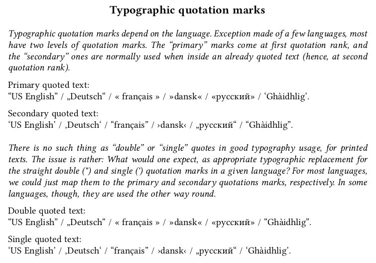

# smartquotes.sile

[](LICENSE)
[](https://github.com/Omikhleia/smartquotes.sile/actions?workflow=Luacheck)
[](https://luarocks.org/modules/Omikhleia/smartquotes.sile)

This small helper package for the [SILE](https://github.com/sile-typesetter/sile)
typesetting system helps obtaining typographic quotation marks depending on the
current language.



The main reason why this package was designed is for “smart” typography in Markdown to be possible for a wide
range of languages, automatically replacing the straight (non-typographic) quotation marks by something
appropriate.

## Installation

This module collection requires SILE v0.14 or upper.

Installation relies on the **luarocks** package manager.

To install the latest development version, you may use the provided “rockspec”:

```
luarocks --lua-version 5.4 install --server=https://luarocks.org/dev smartquotes.sile
```

(Adapt to your version of Lua, if need be, and refer to the SILE manual for more
detailed 3rd-party package installation information.)


## License

All SILE-related code and samples in this repository are released under the MIT License, (c) 2022 Omikhleia.
